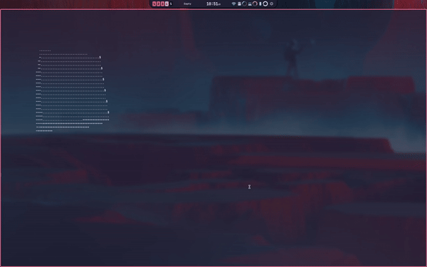

# Spinning Cube

This project explores matrix operations through the visualization of a spinning cube in C. It's inspired by and forked from a YouTube video by Servet Gulnaroglu. The primary goal of this project is to serve as a personal learning exercise to understand the implementation of rotation matrices.



## Original Source
The original inspiration for this project comes from:
[Servet Gulnaroglu's YouTube Video](https://www.youtube.com/watch?v=p09i_hoFdd0)

## Compilation and Execution

To compile and run the project:

1. Ensure you have a C compiler (like GCC) and Make installed on your system.
2. Clone this repository to your local machine.
3. Navigate to the project directory in your terminal.
4. Use the following commands:

   - To compile: 
     ```
     make
     ```
   - To compile and run:
     ```
     make run
     ```
   - To clean up compiled files:
     ```
     make clean
     ```

## Requirements

- C compiler (GCC recommended)
- Make
- UNIX-like environment (for best compatibility with ANSI escape codes)

## How It Works

The program creates a spinning cube using ASCII characters. It utilizes rotation matrices to calculate the position of each point of the cube in 3D space and then projects these points onto a 2D plane for display in the terminal.

## Project Structure

- `cube.c`: Main source file containing the cube rendering logic
- `Makefile`: Build instructions for compiling and running the project
- `img/demo.png`: Demo image of the spinning cube

## Contributing

Feel free to fork this project, submit issues, or send pull requests if you have ideas for improvements or find any bugs.

## License

This project is released under the Unlicense. This is free and unencumbered software released into the public domain. For more information, please refer to <http://unlicense.org/>

---

Note: The visual output may vary depending on your terminal's support for ANSI escape codes and its dimensions. For the best experience, use a terminal with ANSI support and adjust the terminal size as needed.
